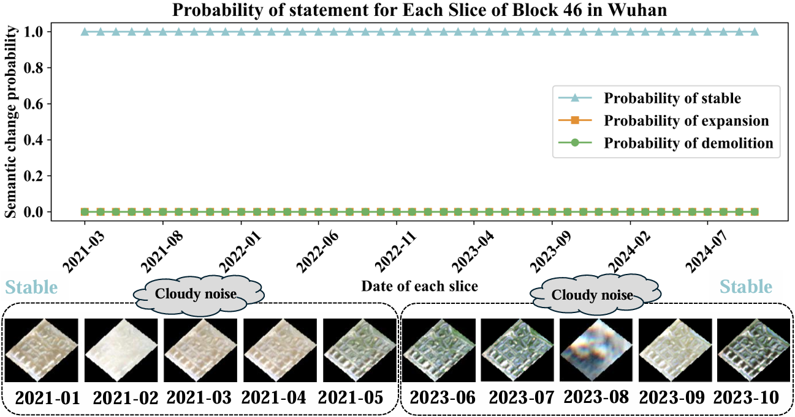

# Semantic-TemporalNet: Refined Detection of Changes in Urban Blocks

**Note**: This project is under active development and will be continuously updated upon publication.


## 🔍 Project Overview

Semantic-TemporalNet is a deep learning framework designed to detect refined temporal changes in urban blocks using multi-temporal remote sensing imagery.

This project code is partially inspired by the architecture in [pytorch-playground.](https://github.com/aaron-xichen/pytorch-playground/)

## 🧪 Example Inference

To evaluate semantic consistency scores of urban blocks, run the following command using the default parser settings:

```bash
python test.py --threshold 0.8
```


This will generate semantic coherence score visualizations for:

### 🏙️ Block 46 (Wuhan)

- Raw Output  
  

- Final Visualization for Paper  
  

### 🏙️ Block 1932 (Wuhan)

- Raw Output  
  

- Final Visualization for Paper  
  

These images illustrate the model's ability to detect and evaluate fine-grained temporal consistency across urban regions.
